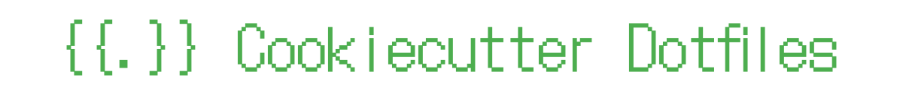

<div align="center">
    
</div>

# cookiecutter-dotfiles <small>v0.1.0</small>

Cookiecutter dotfiles is a template powered by [Cookiecutter](https://github.com/cookiecutter/cookiecutter)
to create a custom and modular dotfiles repository.

For a detailed explanation of the template, please refer to the [documentation](https://mariovagomarzal.github.io/cookiecutter-dotfiles/).

## Quick start

To use the template, you need to have [Cookiecutter](https://github.com/cookiecutter/cookiecutter)
installed. For that, if you already have Python installed, you can run:

```bash
pip install cookiecutter
```

Once you have Cookiecutter installed, you can run the following command to create
a new dotfiles repository in your `~/Projects` directory:

```bash
cookiecutter -o ~/Projects gh:mariovagomarzal/cookiecutter-dotfiles
```

You will be prompted to enter some information about your new dotfiles repository.
Here's an example of the output:

```bash
project_slug [dotfiles]:
author [Your Name]: John Doe
github_username [your_github_username]: johndoe
github_repo [dotfiles]: ↩
default_branch [main]: ↩
dotfiles_dir [$HOME/Projects/dotfiles]: ↩
Select license:
1 - MIT
2 - Apache-2.0
3 - The-Unlicense
Choose from 1, 2, 3 [1]: ↩
Select macos_support:
1 - yes
2 - no
Choose from 1, 2 [1]: ↩
Select linux_support:
1 - yes
2 - no
Choose from 1, 2 [1]: ↩
```

This will create a new directory called `dotfiles` in your `~/Projects` directory with
the following structure:

```bash
dotfiles/
├── LICENSE
├── README.md
├── bootstrap_order_linux.txt
├── bootstrap_order_macos.txt
├── install_order_linux.txt
├── install_order_macos.txt
├── common/
├── linux/
├── macos/
└── src
    ├── bootstrap.sh
    ├── install.sh
    ├── setup.sh
    └── utils.sh
```

The `README.md` file contains the documentation of your dotfiles repository.
Now you can start customizing your repository by adding new files and directories
with your dotfiles. See the [documentation](https://mariovagomarzal.github.io/cookiecutter-dotfiles/)
for more information on how to do that.

## License

This project is licensed by [Mario Vago Marzal](https://github.com/mariovagomarzal) under the terms of the [MIT License](/LICENSE).

_Note: The [LICENSE](/{{cookiecutter.project_slug}}/LICENSE) file in the `{{cookiecutter.project_slug}}` directory is part of the template and does not affect the license of the project itself._
